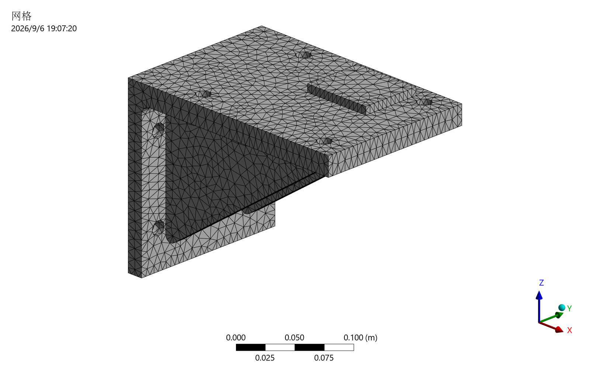
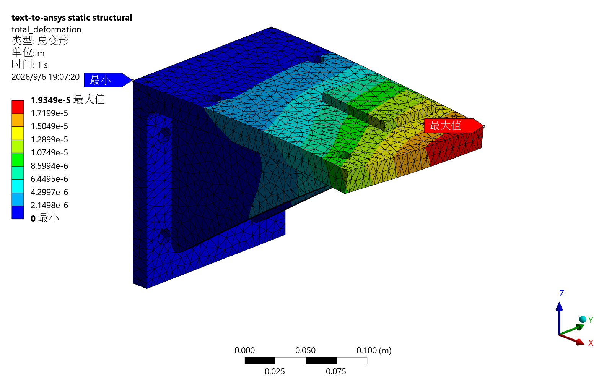
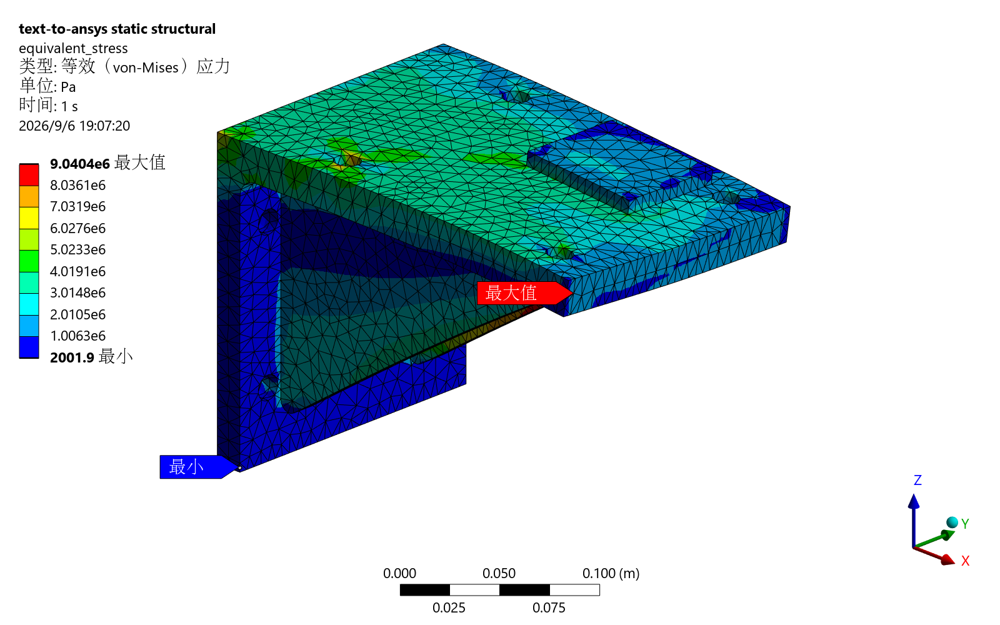

<div align="center">
  <h1>SimStudio</h1>
  <p><strong>From engineering intent to auditable ANSYS Mechanical results.</strong></p>
  <p>Codex Skill · Deterministic simulation compiler · <code>ansys-sim</code> CLI</p>
  <p>
    <a href="https://github.com/kaze-kaze/SimStudio/actions/workflows/ci.yml?query=branch%3Amain"></a>
    
    <a href="LICENSE"></a>
    
  </p>
  <p>
    <strong>English</strong> · <a href="README.zh-CN.md">简体中文</a><br>
    <a href="https://kaze-kaze.github.io/SimStudio/">Website</a> ·
    <a href="https://kaze-kaze.github.io/SimStudio/examples/gusseted-bracket/demo/">Explore the example</a> ·
    <a href="https://kaze-kaze.github.io/SimStudio/docs/reports/mechanical-test-2026-09-06.html">Test report</a> ·
    <a href="#quick-start">Quick start</a>
  </p>
</div>

[](https://kaze-kaze.github.io/SimStudio/examples/gusseted-bracket/demo/)

Images used courtesy of ANSYS, Inc. Cover assembled from recorded results; engineering verification remains **WARN**.

**SimStudio** turns a reviewed engineering request into an explicit `simulation.yaml`, saved Mechanical scripts, traceable run manifests, numerical checks, and reports. The Python package is **`text-to-ansys`**; its command is **`ansys-sim`**. The Codex Skill structures the request, and the deterministic compiler makes the resulting setup inspectable and repeatable.

- **Review before solving.** Units, materials, supports, loads, scopes, and assumptions are explicit.
- **Start offline.** Validate, compile, and dry-run without ANSYS or a license. Real execution requires `--execute`.
- **Keep the evidence.** Inspect saved results through PyDPF and distinguish `PASS`, `WARN`, `FAIL`, and `NOT_RUN`.

## A real engineering example, with its limits

A **240 × 160 × 188 mm** steel equipment bracket combines **two rounded ribs, eight mounting holes, and an eccentric bearing pad**. Its rear face is fully fixed. The front face carries **[1000, 1500, −500] N**, the pad carries **0.8 MPa** pressure over **4200 mm²**, and **12.0284 kg** of steel contributes self-weight. The input selects exact `Structural Steel` and explicit **quadratic** elements.

The **September 6, 2026** study records **5 passed integration tests across 5 real solves in 208.16 seconds** on Windows 11 with ANSYS Student Mechanical 2026 R1, CPython 3.13.2, PyMechanical 0.13.2, and PyDPF 0.16.1. It uses explicit `mechanical_batch`, three combined-load meshes (**12, 8, and 5 mm**), then gravity-only and doubled force/pressure cases on the fine mesh. All five runs are `SOLVED` and `synthetic: false`; **overall engineering status remains `WARN`**.

| Fine combined-load case — recorded quantity | Result |
| --- | ---: |
| Mesh | 5 mm · 27,980 nodes · 15,508 elements |
| Maximum total displacement | 0.019348617 mm |
| Maximum nodal-averaged equivalent stress | 9.040418 MPa |
| Bearing-pad mean Z displacement | −0.009268916 mm |
| Bearing-pad mean / 95th-percentile equivalent stress | 1.291825 / 2.027259 MPa |
| Support reaction Z, summed over support nodes | +3977.967017 N |
| Maximum displacement change, 8 → 5 mm | 0.6556% / 5% tolerance |
| Gravity-corrected full-field relative L2 error | 1.8077 × 10⁻¹¹ |

Independent **force and moment balance, both mesh-refinement steps, and full-field linearity passed**. Pad statistics give each node equal weight; they are not area-weighted. The support reaction is a componentwise sum. Global peak stress is reported for review, not used for strength acceptance. The rear clamp idealizes a rigid mounting interface; bolt preload, contact, slip, weld details, and mounting compliance are not modeled.

<details>
<summary><strong>View the recorded 5 mm mesh and result plots</strong></summary>

### Mesh


Images used courtesy of ANSYS, Inc. Recorded fine mesh: 27,980 nodes and 15,508 elements.

### Total deformation


Images used courtesy of ANSYS, Inc. Maximum total displacement: 0.019348617 mm.

### Equivalent stress


Images used courtesy of ANSYS, Inc. Maximum nodal-averaged equivalent stress: 9.040418 MPa. Engineering status: `WARN`.

</details>

The [static example](https://kaze-kaze.github.io/SimStudio/examples/gusseted-bracket/demo/) shows all five cases, three mesh sizes, and unmodified exports from the **5 mm combined-load case** without running a solver. Read the [full report](docs/reports/mechanical-test-2026-09-06.md) for tolerances, failures, and provenance; inspect the [input specification](examples/gusseted-bracket/simulation.yaml) and [public JSON summary](docs/reports/evidence/2026-09-06/summary.json) to trace the numbers. The committed specification uses **8 mm** as its nominal mesh; the study creates explicit 12 / 8 / 5 mm variants.

The public JSON files are data attachments to the formal test report. Original JUnit, solver projects, RST files, and local logs remain in the ignored local archive. The **252 passed, 20 skipped** offline baseline belongs to the preceding bracket validation round; it is not a new test result from this documentation replacement. The former cantilever remains only as an internal analytical regression fixture under `tests/fixtures/cantilever`.

## How it works

1. **Describe and review** — the Skill records engineering intent, assumptions, and open questions in `simulation_brief.md` and a strict, unit-aware `simulation.yaml`.
2. **Validate and compile** — schema and engineering preflight checks produce a deterministic Mechanical plan and saved script. Exact object names and unique scopes keep selections explicit.
3. **Dry-run, then explicitly execute** — inspect the plan offline; request `--execute` only on a prepared Mechanical host with a valid license.
4. **Inspect and report** — PyDPF extracts numerical results; checks, reports, and input hashes preserve what ran and what remains unverified.

The specification, compiler source, and reference documents are the sources of truth. Fix them and regenerate outputs. User-supplied Python and prose are never executed as source code.

## Quick start

### 1. Install the CLI

The base CLI supports **Python 3.11–3.13**. Use **Python 3.13** if you also plan to install the optional ANSYS clients, which require **Python 3.12–3.13** within this project's supported range.

```bash
git clone https://github.com/kaze-kaze/SimStudio.git
cd SimStudio
python -m venv .venv
```

Activate the environment with `source .venv/bin/activate` on Linux/macOS or `.\.venv\Scripts\Activate.ps1` in PowerShell, then install:

```bash
python -m pip install -e .
```

For Windows setup without changing PowerShell's activation policy, use the direct executable commands in [Windows testing](docs/windows-testing.md).

### 2. Try the bracket offline

```bash
ansys-sim doctor --json
ansys-sim validate examples/gusseted-bracket/simulation.yaml --json
ansys-sim compile examples/gusseted-bracket/simulation.yaml --out build/bracket-compile --json
ansys-sim run examples/gusseted-bracket/simulation.yaml --out build/bracket-dry-run --json
```

The final command returns `DRY_RUN` and starts no Mechanical process. `doctor` can report unavailable solver components on an offline machine. Use a **new or empty output directory** for every compile/run.

Review `normalized-simulation.yaml`, `mechanical-plan.json`, and `generated-mechanical.py`; the dry-run also saves `execution-plan.json`, `verification.json`, `results-summary.json`, `report.md`, and `run-manifest.json`, plus an `inputs/` snapshot. A dry-run does not establish numerical solver results.

### 3. Run Mechanical explicitly

On a separately provisioned and licensed host:

```bash
python -m pip install -e ".[ansys]"
```

The included bracket specification already selects `execution.backend: mechanical_batch`. After validating and dry-running it on the prepared Windows host:

```bash
ansys-sim run examples/gusseted-bracket/simulation.yaml --out build/bracket-real-01 --execute --json
ansys-sim inspect build/bracket-real-01 --json
ansys-sim report build/bracket-real-01 --json
```

This runs the nominal **8 mm** case. Follow [Windows testing](docs/windows-testing.md) for the serial **five-solve study**, including the 5 mm case used in the cover. Batch is an explicit local Windows choice, never an automatic fallback. An earlier local gRPC handshake failed and was not retested by the bracket study. Installing the clients does not install Mechanical or provide a license. See [execution details](skills/ansys-mechanical-static/references/mechanical-execution.md) for other configurations and their requirements.

## Everyday operations

| Command | Purpose |
| --- | --- |
| `ansys-sim init <directory>` | Create a starter specification and brief |
| `ansys-sim doctor --json` | Diagnose the environment and default transport |
| `ansys-sim validate <spec> --json` | Check schema, units, references, and engineering constraints |
| `ansys-sim compile <spec> --out <directory> --json` | Save plans, scripts, and a manifest |
| `ansys-sim run <spec> --out <directory> --json` | Dry-run; add `--execute` for an explicitly requested solve |
| `ansys-sim inspect <run-directory-or-rst> --json` | Inspect saved run data or an RST file |
| `ansys-sim report <run-directory> --json` | Regenerate reports from saved artifacts |

With `--json`, stdout is machine-readable; progress goes to stderr. Exit codes: `0` success, `2` specification/engineering validation, `3` environment/license, `4` Mechanical/solve, `5` postprocessing, `6` verification.

### Use with Codex

The repository includes the [`ansys-mechanical-static` Skill](skills/ansys-mechanical-static/SKILL.md) and a [local plugin marketplace](.agents/plugins/marketplace.json). Following the existing local-development setup, replace the path with your checkout's absolute path:

```bash
codex plugin marketplace add /absolute/path/to/SimStudio --json
codex plugin add text-to-ansys@text-to-ansys-local --json
codex plugin list --json
```

Start a new Codex task to refresh Skill discovery. For the included fixture, try:

> Prepare a dry-run for examples/gusseted-bracket/simulation.yaml. Review the units, rear-face clamp, multiaxial force, eccentric pressure, self-weight, and quadratic mesh. Explain the five-solve acceptance criteria. Show the generated plan and unresolved checks.

## Scope and verification boundaries

**v0.1 scope:** Mechanical linear static structural analysis with small deformation; exact-name `.mechdat` / `.mechdb` templates or one simple STEP/STP solid; fixed supports, forces, pressure, gravity, global mesh sizing, deformation, equivalent stress, and reaction results. Custom isotropic material properties can be represented in the schema, but live material authoring remains blocked pending verification.

Fluent/CFX, nonlinear or transient physics, contact inference, arbitrary assemblies, modal analysis, buckling, fatigue, fracture, and design certification are outside this Skill. See the [supported-scope contract](skills/ansys-mechanical-static/references/supported-scope.md).

| State | Meaning and recorded limits |
| --- | --- |
| `PASS` | A check ran and met its stated condition. The recorded bracket suite passed 5 cases; this is not design approval. |
| `WARN` | Engineering review is required. All five runs retain `stress_singularity_review: WARN`. |
| `FAIL` | A required condition failed. The earlier local gRPC attempt failed; the bracket study does not retest it. |
| `NOT_RUN` | A check was unavailable or not exercised. Missing evidence is never treated as a pass. |

The bracket CLI retains `reaction_balance: NOT_RUN` for mixed pressure/gravity loads and `cantilever_analytical: NOT_RUN` because that comparison is disabled. Separate study checks establish CAD-based force and moment balance. `stress_singularity_review` remains `WARN`; safety factor (no specified yield strength) and automatic `visual_review` remain `NOT_RUN`. The recorded manual image review is separate from the automatic check. Other Mechanical versions, remote execution, and general stress-peak convergence remain unverified.

Both mesh-refinement steps meet 5% displacement and 10% pad stress-statistic tolerances. Linearity uses `u(2P+G) = 2u(P+G) − u(G)` with unchanged gravity and aligned node IDs and coordinates. These criteria apply to this fixture and do not establish a full-field error bound.

SimStudio supports engineering review; it does not provide certification, design approval, or final engineering sign-off. See the [validation policy](skills/ansys-mechanical-static/references/validation-policy.md) and [recorded limitations](docs/reports/mechanical-test-2026-09-06.md#warn-and-not_run).

## Contribute and learn more

Start with [CONTRIBUTING.md](CONTRIBUTING.md) and [AGENTS.md](AGENTS.md). Run the relevant focused checks, then:

```bash
python -m pip install -e ".[dev]"
ruff check .
pytest -q
```

Ordinary tests require no ANSYS, license, or network. Real tests require explicit `ANSYS_AVAILABLE=1`; reproduce the recorded batch suite serially using [Windows testing](docs/windows-testing.md). Report unrun integrations as `NOT_RUN`, preserve acceptance criteria, and fix sources before regenerating artifacts.

- [Schema reference](skills/ansys-mechanical-static/references/schema-reference.md) · [Template example](examples/template-mode/README.md)
- [Official API map](skills/ansys-mechanical-static/references/official-api-map.md) · [Roadmap](ROADMAP.md)
- [Test report](docs/reports/mechanical-test-2026-09-06.md) · [Security reporting](SECURITY.md)

## License and attribution

[MIT](LICENSE). SimStudio is independent open-source software, not affiliated with, endorsed by, or sponsored by ANSYS, Inc. or its affiliates. ANSYS, Mechanical, and Workbench are trademarks of their respective owners. See [NOTICE](NOTICE) for attribution and redistribution details. Do not publish proprietary models, solver archives, license data, credentials, or private paths in issues or contributions.
