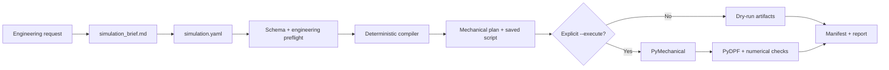

<div align="center">
  <h1>text-to-ansys</h1>
  <p><strong>Auditable ANSYS Mechanical workflows, from engineering intent to reviewable artifacts.</strong></p>
  <p>Simulation compiler · Codex Skill · Python CLI</p>

  <p>
    <a href="https://github.com/kaze-kaze/SimStudio/actions/workflows/ci.yml"></a>
    
    
    <a href="LICENSE"></a>
  </p>

  <p>
    <a href="#quick-start">Quick start</a> ·
    <a href="#how-it-works">How it works</a> ·
    <a href="#supported-scope">Scope</a> ·
    <a href="#codex-skill">Codex Skill</a> ·
    <a href="#development">Development</a>
  </p>
</div>

---

`text-to-ansys` is an open-source Codex Skill and deterministic Python CLI for ANSYS Mechanical
linear static structural analysis. It turns a reviewed engineering request into a strict
`simulation.yaml`, compiles saved Mechanical scripts, records traceable manifests, optionally runs
Mechanical through PyMechanical, inspects results through PyDPF, and produces structured checks and
reports.

> [!IMPORTANT]
> This project is an AI-assisted simulation compiler, not an autonomous CAE engineer. It does not
> provide certification, regulatory compliance, design approval, or final engineering sign-off.

## Why text-to-ansys?

| Reviewable by design | Safe by default | Reproducible output |
| --- | --- | --- |
| Requirements, assumptions, units, scopes, and open questions remain explicit. | Dry-run is the default. A real solver can only be reached with `--execute`. | The same validated specification produces deterministic plans and saved scripts. |
| Every check reports `PASS`, `WARN`, `FAIL`, or `NOT_RUN`. | Vague materials, supports, load scopes, and unsupported physics are never silently inferred. | Manifests hash source inputs and record the generated artifact set. |

### At a glance

| Area | v0.1 capability |
| --- | --- |
| Input modes | Exact-name `.mechdat` / `.mechdb` templates, or one simple STEP/STP solid |
| Analysis | Linear static structural, small deformation |
| Offline workflow | Schema validation, engineering preflight, deterministic compile, dry-run, reports |
| Optional integration | PyMechanical execution and PyDPF result inspection |
| Outputs | Normalized YAML, Mechanical plan, saved script, JSON/CSV checks, report, manifest |
| Safety model | Explicit units, unique scopes, no user-supplied Python execution, opt-in solver access |

## Quick start

### 1. Install the base CLI

Python 3.11 through 3.13 is supported. The base installation does not require ANSYS, a commercial
license, or the optional PyAnsys clients.

```bash
git clone https://github.com/kaze-kaze/SimStudio.git
cd SimStudio
python3.13 -m venv .venv
source .venv/bin/activate
python -m pip install -e .
```

Use `python3.11`, `python3.12`, or `python3.13` according to the supported interpreter installed on
your system. Python 3.14 is intentionally outside the current compatibility range.
For Windows/PowerShell setup and licensed acceptance checks, see [Windows testing](docs/windows-testing.md).

### 2. Run the cantilever example offline

```bash
ansys-sim doctor --json
ansys-sim validate examples/cantilever/simulation.yaml --json
ansys-sim compile examples/cantilever/simulation.yaml \
  --out build/cantilever \
  --json
ansys-sim run examples/cantilever/simulation.yaml \
  --out build/cantilever-dry-run \
  --json
```

No Mechanical process is started. The dry-run produces reviewable artifacts such as:

```text
build/cantilever-dry-run/
├── normalized-simulation.yaml
├── mechanical-plan.json
├── generated-mechanical.py
├── execution-plan.json
├── verification.json
├── results-summary.json
├── report.md
└── run-manifest.json
```

Use a new or empty output directory for every compile/run. Each run also saves its input snapshot
under `inputs/`; existing simulation outputs are not overwritten.

### 3. Enable real Mechanical execution only when ready

Install the optional official clients on a compatible, separately licensed execution host:

```bash
python -m pip install -e ".[ansys]"
ansys-sim doctor --json --strict
ansys-sim run examples/cantilever/simulation.yaml \
  --out build/cantilever-real \
  --execute \
  --json
```

> [!CAUTION]
> Installing `ansys-mechanical-core` and `ansys-dpf-core` does not install ANSYS Mechanical, provide
> a license, or prove that the target Mechanical version is compatible. Review `doctor` output and
> the generated plan before using `--execute`.

## Reproducible benchmark

The committed [cantilever example](examples/cantilever/README.md) provides a neutral STEP fixture and
an analytical reference for offline compilation and result validation.

| Property | Value |
| --- | --- |
| Geometry | `200 mm × 20 mm × 40 mm` rectangular beam |
| Material reference | `Structural Steel`, analytical `E = 200 GPa` |
| Boundary condition | Fixed X-min face |
| Load | `1000 N` in the negative Z direction on the X-max face |
| Analytical tip displacement | `0.125 mm` using Euler-Bernoulli beam theory |

The benchmark does not masquerade as a real solve: analytical checks are only compared with FEA
results after an actual Mechanical run has produced inspectable result data.

## How it works



The editable specification, compiler source, and reference documents are the sources of truth.
`normalized-simulation.yaml`, `mechanical-plan.json`, `generated-mechanical.py`, manifests, reports,
images, and solver files are generated artifacts. Fix the source and regenerate; do not patch a
generated script as the primary solution.

## Supported scope

### Supported in v0.1

- exact-name template workflows from `.mechdat` or `.mechdb`
- one simple solid imported from STEP/STP
- exact Mechanical object names, named selections, and strictly unique `axis_extreme_face` scopes
- exact Engineering Data material names
- fixed support, force, pressure, and gravity
- global element size
- total and directional deformation, equivalent von Mises stress, reaction force, solver messages,
  node count, and element count
- force-only reaction balance, small-deformation, result-completeness, and cantilever analytical checks
- deterministic compile and dry-run without ANSYS
- optional PyMechanical execution and PyDPF result inspection

Custom isotropic material properties can be represented by the schema, but real material authoring is
blocked until that path is verified against a live supported Mechanical version.

### Deliberately out of scope

- Fluent, CFX, explicit dynamics, and LS-DYNA
- transient, nonlinear material, plasticity, large deformation, buckling, fatigue, and fracture
- modal, topology optimization, or arbitrary multi-body assembly workflows
- automatic contact inference or ambiguous load/support/material scope inference
- safety-factor claims without explicit yield-strength data
- certification, design approval, or automatic declarations that a design is safe

See the full [supported-scope contract](skills/ansys-mechanical-static/references/supported-scope.md)
before extending the compiler to new physics or topology.

## CLI reference

| Command | Purpose |
| --- | --- |
| `ansys-sim doctor [--json] [--strict]` | Diagnose Mechanical, DPF, platform, transport, and execution readiness |
| `ansys-sim init <directory>` | Create starter `simulation.yaml` and brief templates |
| `ansys-sim validate <simulation.yaml> [--json]` | Validate schema, units, references, scope rules, and engineering preflight |
| `ansys-sim compile <simulation.yaml> --out <directory> [--json]` | Generate deterministic plans, scripts, environment data, and a manifest |
| `ansys-sim run <simulation.yaml> [--out <directory>] [--execute] [--json]` | Create a dry-run by default, or explicitly execute Mechanical |
| `ansys-sim inspect <run-directory-or-rst> [--json]` | Inspect saved run data or an existing RST result |
| `ansys-sim report <run-directory> [--json]` | Rebuild human-readable and machine-readable reports |

stdout remains machine-readable when JSON output is requested; progress and diagnostics go to stderr.
Stable exit codes are `0` success, `2` specification/engineering validation, `3` environment/license,
`4` Mechanical/solve, `5` postprocessing, and `6` verification.

## Validation semantics

| State | Meaning |
| --- | --- |
| `PASS` | The check ran and its acceptance condition was satisfied |
| `WARN` | The workflow can continue, but engineering review is required |
| `FAIL` | A required condition failed and the result must not be accepted |
| `NOT_RUN` | The evidence or environment needed for the check was unavailable |

Unavailable solver, DPF, image, or licensing evidence is never converted into `PASS`. Fake-backend
outputs remain permanently labeled synthetic.

## Codex Skill

The repository root is also a Codex plugin. Its manifest points to the single Skill implementation at
[`skills/ansys-mechanical-static`](skills/ansys-mechanical-static/SKILL.md). For local plugin
development, use a clean checkout and replace the example path below with its absolute path:

```bash
codex plugin marketplace add /absolute/path/to/SimStudio --json
codex plugin add text-to-ansys@text-to-ansys-local --json
codex plugin list --json
```

Start a new Codex task after installation so Skill discovery is refreshed. The Skill handles
Mechanical linear-static setup, exact-name template changes, dry-runs, explicit solves, RST
inspection, and reporting; it intentionally declines unsupported physics and certification requests.

## Project structure

```text
SimStudio/
├── .codex-plugin/                 # Codex plugin manifest
├── .agents/plugins/               # Local marketplace definition
├── schemas/                       # Public simulation JSON Schema
├── skills/ansys-mechanical-static/
│   ├── SKILL.md                   # Skill behavior and safety contract
│   ├── references/                # API, schema, execution, and validation notes
│   └── scripts/ansys_skill/       # CLI, compiler, backends, checks, and reporting
├── examples/
│   ├── cantilever/                # Reproducible geometry-mode benchmark
│   └── template-mode/             # Exact-name template workflow
└── tests/                         # Offline unit tests and opt-in ANSYS integration tests
```

## Documentation

| Guide | Description |
| --- | --- |
| [Schema reference](skills/ansys-mechanical-static/references/schema-reference.md) | `simulation.yaml` fields, units, and constraints |
| [Mechanical execution](skills/ansys-mechanical-static/references/mechanical-execution.md) | Local/remote execution, transport, ownership, and timeouts |
| [Validation policy](skills/ansys-mechanical-static/references/validation-policy.md) | Pre-solve and post-solve acceptance rules |
| [Official API map](skills/ansys-mechanical-static/references/official-api-map.md) | Supported client versions, signatures, and verification status |
| [Engineering safety](skills/ansys-mechanical-static/references/engineering-safety.md) | Human-review and certification boundaries |
| [Template-mode example](examples/template-mode/README.md) | Safe setup for an existing licensed Mechanical project |

## Development

Install the development dependencies and run the same offline checks used by CI:

```bash
python -m pip install -e ".[dev]"
ruff check .
pytest -q -m "not ansys_integration"
```

The ordinary test suite must not require ANSYS, a license, or network access. Real integration tests
are separate and must be enabled only on a compatible licensed host:

```bash
ANSYS_AVAILABLE=1 pytest -q -m ansys_integration
```

Before opening a change, read [CONTRIBUTING.md](CONTRIBUTING.md), inspect the final diff, and report
any integration that remained `NOT_RUN`. Future directions are tracked in [ROADMAP.md](ROADMAP.md).

## Security, licensing, and trademarks

Please report vulnerabilities through the source host's private security-advisory flow described in
[SECURITY.md](SECURITY.md). Do not attach proprietary geometry, Mechanical projects, result archives,
credentials, license data, or private paths to public issues.

This project is available under the [MIT License](LICENSE). It is independent open-source software
and is not affiliated with, endorsed by, or sponsored by ANSYS, Inc. or its affiliates. ANSYS,
Mechanical, Workbench, and related names are trademarks of their respective owners. See [NOTICE](NOTICE)
for dependency and redistribution details.
