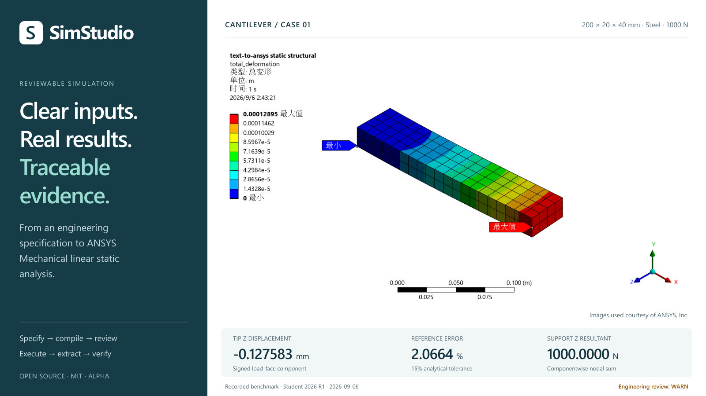
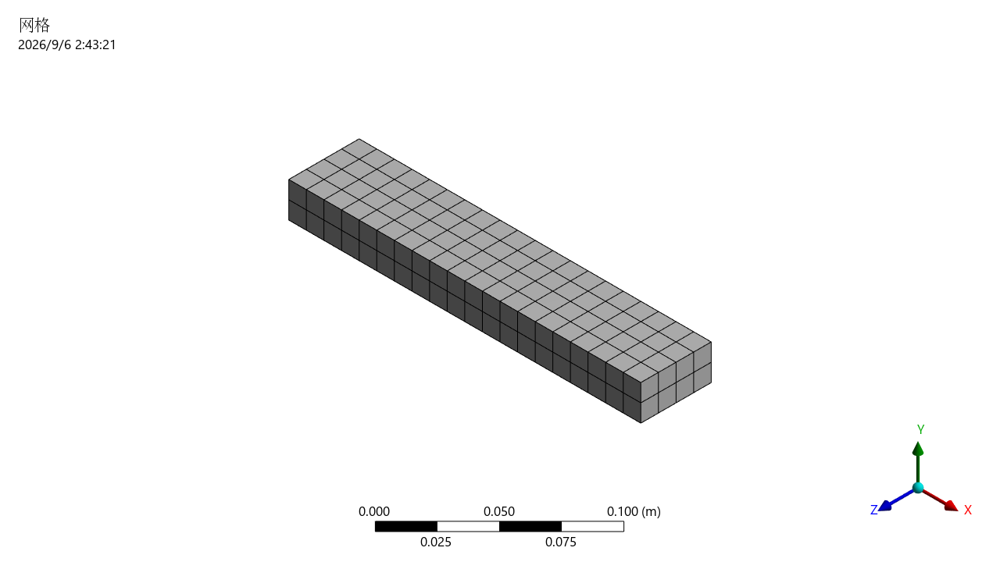
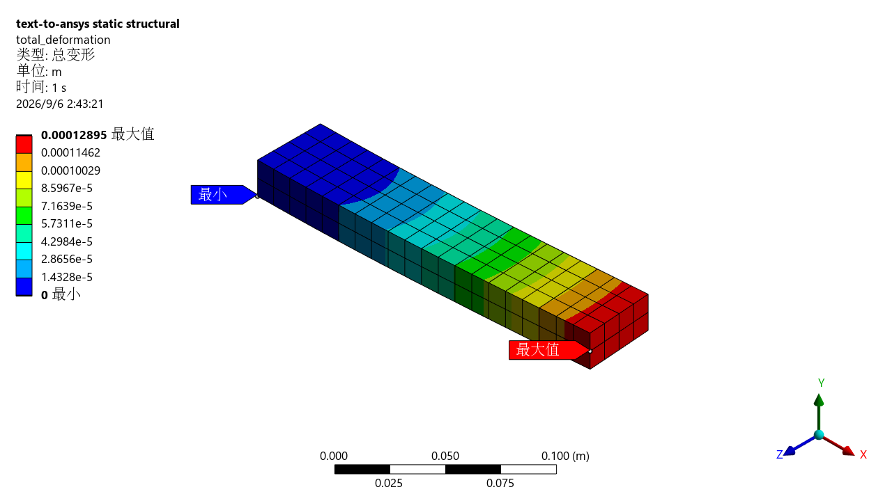
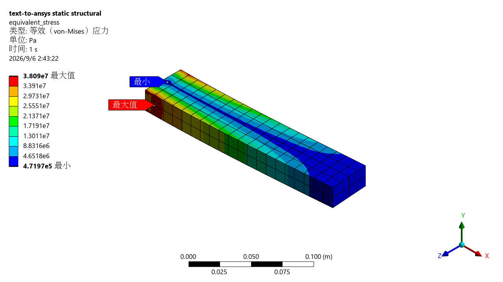

<div align="center">
  <h1>SimStudio</h1>
  <p><strong>将工程需求转化为可审查、可追溯的 ANSYS Mechanical 仿真结果。</strong></p>
  <p>Codex Skill · 确定性仿真编译器 · <code>ansys-sim</code> CLI</p>
  <p>
    <a href="https://github.com/kaze-kaze/SimStudio/actions/workflows/ci.yml?query=branch%3Amain"></a>
    
    <a href="LICENSE"></a>
    
  </p>
  <p>
    <a href="README.md">English</a> · <strong>简体中文</strong><br>
    <a href="https://kaze-kaze.github.io/SimStudio/">在线首页</a> ·
    <a href="https://kaze-kaze.github.io/SimStudio/examples/cantilever/demo/">浏览实例</a> ·
    <a href="https://kaze-kaze.github.io/SimStudio/docs/reports/mechanical-test-2026-09-06.zh-CN.html">测试报告</a> ·
    <a href="#快速开始">快速开始</a>
  </p>
</div>

[](https://kaze-kaze.github.io/SimStudio/examples/cantilever/demo/)

Images used courtesy of ANSYS, Inc. 封面由已记录的真实结果排版组成；工程校核状态仍为 **WARN**。

**SimStudio** 将经过审查的工程需求转化为明确的 `simulation.yaml`、保存的 Mechanical 脚本、可追溯的运行清单、数值校核和报告。Python 包名为 **`text-to-ansys`**，命令为 **`ansys-sim`**。Codex Skill 负责整理需求，确定性编译器让仿真设置可以检查、可以复现。

- **先审查，再求解。** 单位、材料、约束、载荷、作用范围与假设均明确记录。
- **从离线流程开始。** 无需 ANSYS 或许可证即可校验、编译和 dry-run；真实执行必须指定 `--execute`。
- **保留验证证据。** 使用 PyDPF 读取保存的数值结果，区分 `PASS`、`WARN`、`FAIL` 和 `NOT_RUN`。

## 真实实例与验证边界

一根 **200 × 20 × 40 mm** 的钢制悬臂梁，X-min 端面固定，X-max 端面承受 **Z 方向 −1000 N** 的力。输入指定精确材料名 `Structural Steel`、**10 mm** 全局网格尺寸和 `program_controlled` 单元阶次；解析参考采用 **E = 200 GPa**。

**2026 年 9 月 6 日**的验收记录包含 **9 项用例通过，对应 5 次真实求解**。环境为 Windows 11、ANSYS Student Mechanical 2026 R1、CPython 3.13.2、PyMechanical 0.13.2 和 PyDPF 0.16.1，显式选择 `mechanical_batch` 后端。五次运行均为非合成结果，**工程校核总状态均保留为 `WARN`**。

| 力载荷悬臂梁：记录的量 | 结果 |
| --- | ---: |
| 网格 | 1,077 个节点 · 160 个单元 |
| 端部 Z 位移 | −0.127583 mm |
| Euler–Bernoulli 解析参考幅值 | 0.125 mm |
| 解析偏差 / 允许误差 | 2.0664% / 15% |
| 最大总位移 | 0.128951 mm |
| 节点平均等效应力最大值 | 38.0902 MPa |
| 支承节点反力合计 Z 分量 | +1000.000000009 N |

端部 Z 位移取载荷面 37 个节点中绝对值最大的 Z 分量，并保留符号。支承反力为向量求和结果，不是单节点反力最大值。峰值应力仍需结合应力集中和网格收敛进行工程审查。

<details>
<summary><strong>查看原始网格与结果云图</strong></summary>

### 网格


Images used courtesy of ANSYS, Inc. 记录网格：1,077 个节点、160 个单元。

### 总位移


Images used courtesy of ANSYS, Inc. 图中单位为 m；最大值约为 0.128951 mm。

### 等效应力


Images used courtesy of ANSYS, Inc. 图中单位为 Pa；最大值约为 38.0902 MPa。工程状态：`WARN`。

</details>

9 项用例覆盖力载荷、压力、重力、`.mechdat` / `.mechdb` 模板同步、三张 PNG 导出，以及原始 RST 检查与报告再生成。[静态实例](https://kaze-kaze.github.io/SimStudio/examples/cantilever/demo/) 展示已保存的证据，无需启动求解器。完整容差、失败过程和来源见[测试报告](docs/reports/mechanical-test-2026-09-06.zh-CN.md)；数值可追溯至[输入规格](examples/cantilever/simulation.yaml)和[公开证据](docs/reports/evidence/2026-09-06/summary.json)。

## 工作方法

1. **整理需求并审查** — Skill 将工程意图、假设与未决问题写入 `simulation_brief.md` 和严格校验单位的 `simulation.yaml`。
2. **校验并编译** — 通过 Schema 与工程前置检查，生成确定性的 Mechanical 计划与脚本；精确对象名和唯一作用范围让选择过程明确可查。
3. **先 dry-run，再显式执行** — 离线检查计划；准备好 Mechanical 主机及有效许可证后，按明确的求解请求使用 `--execute`。
4. **提取结果并报告** — PyDPF 提取数值，校核结果、报告和输入哈希记录实际执行内容及尚未验证的部分。

规格、编译器源代码和参考文档是事实来源。修复这些源文件后重新生成输出。用户提供的 Python 和自然语言不会作为源代码执行。

## 快速开始

### 1. 安装 CLI

基础 CLI 支持 **Python 3.11–3.13**。如需安装可选 ANSYS 客户端，推荐使用 **Python 3.13**；这些客户端在本项目中的支持范围为 **Python 3.12–3.13**。

```bash
git clone https://github.com/kaze-kaze/SimStudio.git
cd SimStudio
python -m venv .venv
```

Linux/macOS 使用 `source .venv/bin/activate` 激活环境，PowerShell 使用 `.\.venv\Scripts\Activate.ps1`，然后安装：

```bash
python -m pip install -e .
```

如需在 Windows 上直接调用环境内的可执行文件，避免调整 PowerShell 激活策略，请参考 [Windows 测试指南](docs/windows-testing.md)。

### 2. 离线运行悬臂梁示例

```bash
ansys-sim doctor --json
ansys-sim validate examples/cantilever/simulation.yaml --json
ansys-sim compile examples/cantilever/simulation.yaml --out build/cantilever-compile --json
ansys-sim run examples/cantilever/simulation.yaml --out build/cantilever-dry-run --json
```

最后一条命令返回 `DRY_RUN`，不启动 Mechanical 进程。离线主机上的 `doctor` 可能报告求解器组件不可用。每次编译或运行都使用**新的或空的输出目录**。

检查 `normalized-simulation.yaml`、`mechanical-plan.json` 和 `generated-mechanical.py`；dry-run 还会保存 `execution-plan.json`、`verification.json`、`results-summary.json`、`report.md`、`run-manifest.json` 及 `inputs/` 输入快照。dry-run 不构成数值求解结果。

### 3. 显式执行 Mechanical

在已单独安装 Mechanical 并配置有效许可证的主机上安装客户端：

```bash
python -m pip install -e ".[ansys]"
```

按 [Windows 测试指南](docs/windows-testing.md)创建 `build/windows-inputs/simulation.yaml`，保持几何路径有效，并明确设置 `execution.backend: mechanical_batch`。先校验并 dry-run 这份副本，再执行求解：

```bash
ansys-sim run build/windows-inputs/simulation.yaml --out build/windows-real-01 --execute --json
ansys-sim inspect build/windows-real-01 --json
ansys-sim report build/windows-real-01 --json
```

原始示例选择的是 `pymechanical_remote`。记录中的首次 gRPC 尝试在握手阶段失败；batch 通过不能证明 gRPC 可用。Batch 必须在本机 Windows 上显式选择，不会在连接失败后自动切换。安装客户端不会安装 Mechanical 或提供许可证。其他配置及其要求见[执行指南](skills/ansys-mechanical-static/references/mechanical-execution.md)。

## 日常操作

| 命令 | 用途 |
| --- | --- |
| `ansys-sim init <directory>` | 创建初始规格与需求简报 |
| `ansys-sim doctor --json` | 诊断环境和默认传输配置 |
| `ansys-sim validate <spec> --json` | 检查 Schema、单位、引用与工程约束 |
| `ansys-sim compile <spec> --out <directory> --json` | 保存计划、脚本和运行清单 |
| `ansys-sim run <spec> --out <directory> --json` | 默认 dry-run；明确请求真实求解时添加 `--execute` |
| `ansys-sim inspect <run-directory-or-rst> --json` | 检查已保存的运行数据或 RST 文件 |
| `ansys-sim report <run-directory> --json` | 从保存的产物重新生成报告 |

使用 `--json` 时，stdout 为机器可读输出，进度写入 stderr。退出码：`0` 成功，`2` 规格或工程校验，`3` 环境或许可证，`4` Mechanical 或求解，`5` 后处理，`6` 结果验证。

### 配合 Codex 使用

仓库包含 [`ansys-mechanical-static` Skill](skills/ansys-mechanical-static/SKILL.md) 和[本地插件市场配置](.agents/plugins/marketplace.json)。沿用现有的本地开发安装方式，将下方路径替换为检出目录的绝对路径：

```bash
codex plugin marketplace add /absolute/path/to/SimStudio --json
codex plugin add text-to-ansys@text-to-ansys-local --json
codex plugin list --json
```

安装后新建 Codex 任务，以刷新 Skill 发现。可以用仓库自带的示例开始：

> 为 examples/cantilever/simulation.yaml 准备一次 dry-run。检查单位、固定约束、Z 方向 −1000 N 载荷、网格与解析对照，展示生成的计划和未完成的校核。

## 支持范围与验证边界

**v0.1 范围：** Mechanical 小变形线性静力结构分析；使用精确对象名的 `.mechdat` / `.mechdb` 模板，或单个简单 STEP/STP 实体；支持固定约束、力、压力、重力、全局网格尺寸、位移、等效应力和反力结果。Schema 可以表达自定义各向同性材料参数，但真实材料创建仍被阻止，等待接口验证。

Fluent/CFX、非线性或瞬态物理、接触推断、任意装配体、模态分析、屈曲、疲劳、断裂和设计认证均超出本 Skill 范围。详见[支持范围约定](skills/ansys-mechanical-static/references/supported-scope.md)。

| 状态 | 含义与记录中的边界 |
| --- | --- |
| `PASS` | 检查已执行且满足其条件。记录中的套件通过 9 项用例，不代表设计获准使用。 |
| `WARN` | 需要工程审查。五次运行均保留 `stress_singularity_review: WARN`。 |
| `FAIL` | 必需条件未满足。首轮 gRPC 尝试失败，问题仍未解决。 |
| `NOT_RUN` | 检查缺少条件或尚未执行。缺失证据不得计为通过。 |

安全系数（未指定屈服强度）、视觉工程审查、远程执行、原始 RST 的工程校核与规格恢复均保留 `NOT_RUN`。压力和重力通过了独立基准断言，但其通用 `reaction_balance`、`cantilever_analytical` 检查仍为 `NOT_RUN`。网格收敛、显式单元阶次变体及其他 Mechanical 版本尚未验证。图像导出检查仅证明文件可用，不能替代视觉工程审查。

SimStudio 辅助工程审查，不提供认证、设计批准或最终工程签署。详见[校核策略](skills/ansys-mechanical-static/references/validation-policy.md)与[完整测试报告](docs/reports/mechanical-test-2026-09-06.zh-CN.md)。

## 参与贡献与延伸阅读

从 [CONTRIBUTING.md](CONTRIBUTING.md) 和 [AGENTS.md](AGENTS.md) 开始。先运行与改动直接相关的检查，再执行：

```bash
python -m pip install -e ".[dev]"
ruff check .
pytest -q
```

普通测试不依赖 ANSYS、许可证或网络。真实测试必须显式设置 `ANSYS_AVAILABLE=1`；按照 [Windows 测试指南](docs/windows-testing.md)串行复现已记录的 batch 套件。未执行的集成应报告为 `NOT_RUN`，保留验收标准，并先修复源文件再重新生成产物。

- [Schema 参考](skills/ansys-mechanical-static/references/schema-reference.md) · [模板示例](examples/template-mode/README.md)
- [官方 API 对照](skills/ansys-mechanical-static/references/official-api-map.md) · [路线图](ROADMAP.md)
- [发布准备](docs/release-preparation.md) · [安全问题报告](SECURITY.md)

## 许可与署名

采用 [MIT 许可证](LICENSE)。SimStudio 是独立开源软件，与 ANSYS, Inc. 及其关联公司没有隶属、背书或赞助关系。ANSYS、Mechanical、Workbench 等名称属于各自权利人的商标。署名与再分发说明见 [NOTICE](NOTICE)。请勿在公开问题或贡献中提交专有模型、求解器归档、许可证数据、凭据或私人路径。
